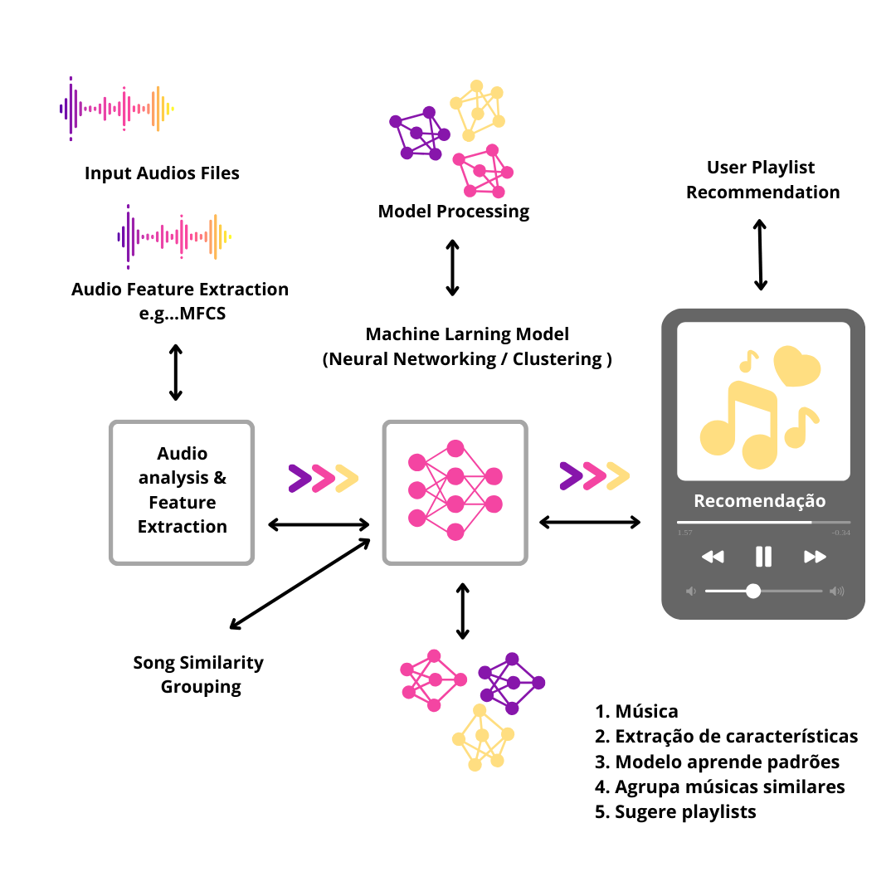

# ChordAI

---

# Sistema de Recomendação de Músicas com Análise Acústica

## 1. Visão Geral e Objetivo do Projeto

O **Sistema de Recomendação de Músicas com Análise Acústica** propõe uma nova abordagem para a recomendação musical, superando os métodos tradicionais baseados em metadados (artista, gênero, popularidade). Nosso objetivo é recomendar músicas com base em suas **características sonoras intrínsecas**, como timbre, ritmo e harmonia, utilizando o processamento digital de sinais e algoritmos de aprendizado de máquina. Isso permite que o sistema descubra e sugira canções de diferentes gêneros e épocas, encontrando "assinaturas" sonoras semelhantes que um ser humano poderia não perceber.

---

## 2. Tecnologias Utilizadas

O projeto é desenvolvido inteiramente em **Python**, aproveitando seu vasto ecossistema de bibliotecas para ciência de dados e aprendizado de máquina.

### Processamento de Áudio
* **Librosa:** Biblioteca fundamental para carregar arquivos de áudio e extrair suas características acústicas. Utilizada principalmente para a extração de **Mel-Frequency Cepstral Coefficients (MFCCs)**, que são ideais para representar a textura sonora, além de outras métricas como o **BPM (Batidas Por Minuto)**.

### Modelagem de Machine Learning
* **Scikit-learn:** Usado para implementar o modelo de **clustering**, como o **K-Means**. Esse algoritmo agrupa as músicas em 'clusters' (grupos) com base em suas similaridades sonoras, formando a base da nossa lógica de recomendação.
* **TensorFlow / PyTorch (Opcional - Implementação Avançada):** Frameworks para a construção de modelos de **Deep Learning**, como uma **rede neural autoencoder**. Essa abordagem pode ser usada para comprimir as características de áudio de alta dimensão em uma representação mais eficiente e rica.

### Armazenamento e Interface
* **Bancos de Dados Relacionais ou NoSQL:** Para armazenar as características das músicas extraídas offline, otimizando o tempo de resposta online.
* **Streamlit / Flask:** Frameworks para a criação de uma interface de usuário simples e interativa, permitindo a demonstração do projeto.

---

## 3. Arquitetura do Sistema

A arquitetura do projeto é dividida em duas fases distintas, visando otimizar o desempenho e a escalabilidade.

### Fase 1: Processamento Offline (Otimização e Treinamento)
1.  **Coleta do Dataset:** O sistema começa com uma coleção de arquivos de áudio.
2.  **Extração de Características:** Um script em Python, utilizando o **Librosa**, processa cada arquivo de áudio. As características acústicas (MFCCs, BPM, etc.) são extraídas e transformadas em vetores numéricos.
3.  **Armazenamento de Dados:** Os vetores de características são salvos em um banco de dados, junto com os metadados de cada música (título, artista).
4.  **Treinamento do Modelo:** O modelo de clustering (K-Means) é treinado com os dados do banco de dados. O modelo aprende a agrupar as músicas em 'clusters' de similaridade sonora.

### Fase 2: Recomendação Online (Serviço de Recomendação)
1.  **Entrada do Usuário:** O usuário seleciona uma música que deseja usar como base para a recomendação.
2.  **Processamento em Tempo Real:** As características acústicas da música selecionada são extraídas instantaneamente, da mesma forma que na fase offline.
3.  **Busca por Similaridade:** O vetor de características da música de entrada é comparado com os 'clusters' do modelo treinado. O sistema identifica o cluster ao qual essa música pertence.
4.  **Entrega da Recomendação:** Todas as outras músicas que se encontram no mesmo cluster são retornadas ao usuário como a lista de recomendação.

---

## 4. Como Executar o Projeto

1.  **Clone o Repositório:** `git clone [URL_DO_REPOSITÓRIO]`
2.  **Instale as Dependências:** `pip install -r requirements.txt` (O arquivo `requirements.txt` deve incluir `librosa`, `scikit-learn`, `numpy`, `pandas`, `streamlit` ou `flask`).
3.  **Adicione seu Dataset:** Coloque os arquivos de áudio em uma pasta específica (ex: `/data`).
4.  **Execute o Script de Processamento Offline:** `python scripts/process_audio.py`
5.  **Execute o Aplicativo de Recomendação:** Se estiver usando Flask, `flask run`; se for Streamlit, `streamlit run app.py`.

---

## 5. Possíveis Melhorias e Recursos Futuros

* **Feedback do Usuário:** Adicionar um sistema de "gostei/não gostei" para refinar o modelo de recomendação com base nas interações do usuário.
* **Visualização de Dados:** Implementar uma visualização interativa (e.g., usando t-SNE) para plotar as músicas em um gráfico 2D, mostrando visualmente como os 'clusters' se formam.
* **API de Recomendação:** Criar uma API RESTful para que o sistema possa ser facilmente integrado com outras aplicações.

